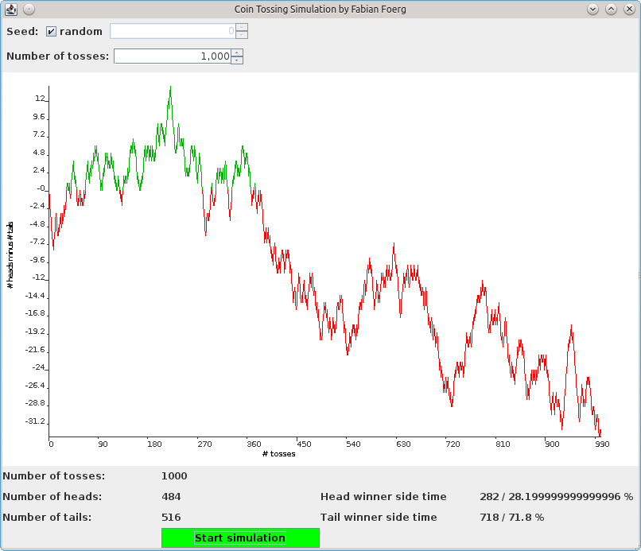

## CoinTossingGUI

### About

This program simulates a sequence of coin tossing events and visualizes the
corresponding 2-dimensional random walk.
I originally created this program for the seminar "Random Walks" at the
University of Passau in summer 2010.

### Libraries

This program utilizes the [JChart2D](http://jchart2d.sourceforge.net/) plotting library.
Java in version 6 or higher is required to run this program.

### Screenshot 

### Copyright

Copyright 2014 Fabian Foerg

Licensed under the GPLv3: http://www.gnu.org/licenses/gpl-3.0.html
